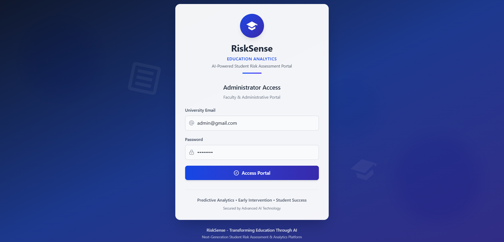
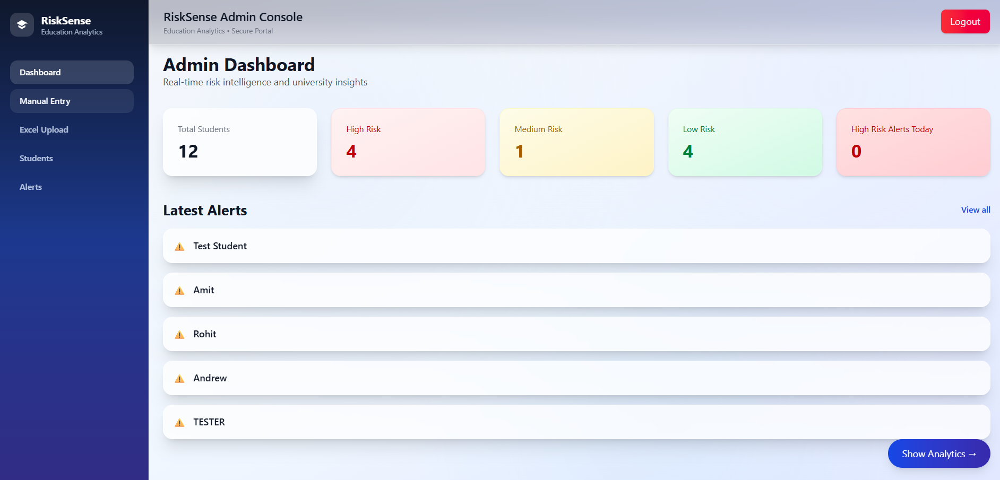
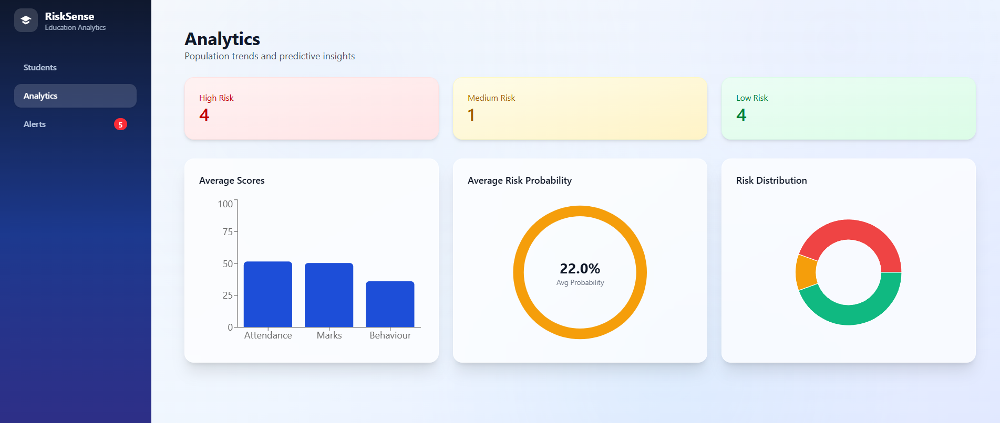

# 🎓 RiskSense – AI-Powered Education Analytics

<div align="center">

**Proactive Student Risk Prediction & Academic Performance Analytics Platform**

[](https://www.python.org/)
[](https://fastapi.tiangolo.com/)
[](https://reactjs.org/)
[](https://www.mongodb.com/)
[](LICENSE)

</div>

---

## 📋 Table of Contents

- [Overview](#-overview)
- [Problem Statement](#-problem-statement)
- [Key Features](#-key-features)
- [System Architecture](#-system-architecture)
- [AI/ML Model Explanation](#-aiml-model-explanation)
- [Tech Stack](#-tech-stack)
- [Project Structure](#-project-structure)
- [Installation & Setup](#-installation--setup)
- [API Documentation](#-api-documentation)
- [Database Schema](#-database-schema)
- [Screenshots](#-screenshots)
- [Usage Guide](#-usage-guide)
- [Future Enhancements](#-future-enhancements)
- [Contributing](#-contributing)
- [License](#-license)

---

## 🌟 Overview

**RiskSense** is a comprehensive AI-powered web application designed to help educational institutions identify at-risk students early and take proactive interventions. The platform analyzes student attendance, academic performance, and behavioral patterns using machine learning to predict academic risk with high confidence scores.

### Why RiskSense?

Educational institutions face significant challenges in:
- Identifying struggling students before it's too late
- Tracking performance trends across multiple subjects
- Analyzing behavioral and attendance patterns
- Making data-driven intervention decisions
- Managing large student populations effectively

**RiskSense transforms raw student data into actionable insights**, enabling educators to focus resources where they're needed most.

---

## 🎯 Problem Statement

Traditional educational monitoring systems are:
- ❌ **Reactive** – Problems identified only after failures occur
- ❌ **Manual** – Time-consuming data analysis by educators
- ❌ **Incomplete** – Missing holistic view of student performance
- ❌ **Unscalable** – Cannot handle large student populations

### Our Solution

RiskSense provides:
- ✅ **Proactive Prediction** – AI identifies at-risk students early
- ✅ **Automated Analysis** – Real-time risk calculation and alerts
- ✅ **Comprehensive Insights** – Multi-dimensional student analytics
- ✅ **Scalable Platform** – Handles thousands of students efficiently

---

## 🚀 Key Features

### 🤖 AI-Powered Risk Prediction
- Machine learning model trained on 1,500+ student records
- Predicts academic risk with confidence scores (0-100%)
- Real-time prediction on student entry/update
- Three risk levels: **Stable**, **Monitor**, **Needs Attention**

### 📊 Interactive Analytics Dashboard
- Student overview with AI status badges
- Subject-wise performance visualization (bar/line charts)
- Confidence score circular gauge
- Weak subject detection and recommendations
- Attendance, marks, and behavior metrics

### 👨‍💼 Admin Portal
- Secure JWT-based authentication
- Complete student CRUD operations
- Manual student entry with subject-wise marks
- Bulk Excel upload (`.xlsx`, `.csv`)
- Student search and filtering
- Delete with cascade (removes from all collections)

### 🚨 Intelligent Alerts System
- Automatic alert generation for high-risk students
- Real-time notifications dashboard
- Severity-based categorization (HIGH/MEDIUM/LOW)
- Student-specific alert filtering
- Mark as read/unread functionality

### 🏷️ Dynamic Badge System
Multiple simultaneous badges based on:
- 🟢 **Stable** – All metrics healthy (confidence ≥75%, attendance ≥70%, marks ≥65%, behavior ≥50)
- 🟡 **Needs Monitoring** – Moderate confidence (50-75%)
- 🟠 **Attendance Issue** – Attendance < 50%
- 🔴 **Performance Drop** – Average marks < 50
- 🟣 **Behaviour Alert** – Behavior score < 40
- ⚪ **Low Data Confidence** – AI confidence < 40%

### 📁 Excel Data Ingestion
- Upload bulk student data via Excel files
- Automatic data validation and parsing
- Student grouping by name (handles multiple subject rows)
- Duplicate detection (update vs. insert)
- Detailed upload results with counts
- Auto-refresh after successful upload

### 📝 Notes & Observations
- Teachers can add qualitative observations
- Linked to individual students
- Timestamped entries
- Viewable in student detail pages

---

## 🏗️ System Architecture

```
┌─────────────────────────────────────────────────────────────┐
│                     Frontend (React)                        │
│  ┌──────────┐  ┌──────────┐  ┌──────────┐  ┌──────────┐   │
│  │ Students │  │Analytics │  │  Alerts  │  │  Admin   │   │
│  │   View   │  │Dashboard │  │  Panel   │  │  Portal  │   │
│  └──────────┘  └──────────┘  └──────────┘  └──────────┘   │
└────────────────────┬────────────────────────────────────────┘
                     │ REST API (Axios)
┌────────────────────┴────────────────────────────────────────┐
│                  Backend (FastAPI)                          │
│  ┌──────────┐  ┌──────────┐  ┌──────────┐  ┌──────────┐   │
│  │ Student  │  │Prediction│  │  Alerts  │  │   Auth   │   │
│  │  Routes  │  │  Routes  │  │  Routes  │  │  Routes  │   │
│  └──────────┘  └──────────┘  └──────────┘  └──────────┘   │
│         │              │              │            │        │
│  ┌──────┴──────────────┴──────────────┴────────────┴────┐  │
│  │              Services Layer                           │  │
│  │  - Alert Service  - Risk Service  - Feature Engine   │  │
│  └──────────────────────┬────────────────────────────────┘  │
└────────────────────────┬────────────────────────────────────┘
                         │
        ┌────────────────┴───────────────┐
        │                                │
┌───────┴────────┐            ┌──────────┴──────────┐
│   MongoDB      │            │  ML Model (Trained) │
│                │            │                     │
│ - students     │            │ - risk_model.pkl    │
│ - alerts       │            │ - label_encoder.pkl │
│ - notes        │            │ - RandomForest      │
└────────────────┘            └─────────────────────┘
```

### Component Breakdown

#### **Frontend (React + Vite + Tailwind CSS)**
- **Portal Pages**: Student list, analytics, alerts, admin dashboard
- **Components**: StudentCard, RiskBadge, LineChart, Navbar, Sidebar
- **Routing**: Protected routes for admin, public student views
- **State Management**: React hooks (useState, useEffect)
- **API Integration**: Axios with base URL configuration

#### **Backend (FastAPI + Motor)**
- **Routes**: Student CRUD, prediction, alerts, analytics, admin auth
- **Services**: Alert generation, risk calculation, feature engineering
- **Validation**: Pydantic v2 schemas with ConfigDict
- **Database**: Async MongoDB operations with Motor
- **ML Integration**: Real-time prediction using trained model

#### **Database (MongoDB)**
- **Collections**: students, alerts, notes
- **Indexes**: By student_id, name, created_at
- **Operations**: Async queries, cascade deletes, bulk inserts

#### **ML Layer (scikit-learn)**
- **Algorithm**: Random Forest Classifier (200 estimators)
- **Features**: attendance, average_marks, behaviour
- **Output**: predicted_label, confidence_score
- **Persistence**: Joblib serialization (.pkl files)

---

## 🧠 AI/ML Model Explanation

### How the AI Predicts Student Risk

#### 📚 Training Data
- **Dataset**: 1,500 student records
- **Source**: `backend/app/ml/data/risksense_1500_students_dataset.xlsx`
- **Columns**: student_name, attendance, behaviour, maths, dbms, java, oops, se, english, avg_marks, risk_label

#### 🎯 Features Used
The model learns from **3 key features**:

| Feature | Description | Why Important |
|---------|-------------|---------------|
| **Attendance** | Percentage of classes attended | Correlates strongly with engagement |
| **Average Marks** | Mean of all subject scores | Direct academic performance indicator |
| **Behaviour** | Classroom conduct score (0-100) | Indicates focus and discipline |

#### 🤖 Algorithm: Random Forest Classifier

```python
RandomForestClassifier(n_estimators=200, random_state=42)
```

**Why Random Forest?**
- ✅ Handles non-linear relationships
- ✅ Robust to outliers and missing data
- ✅ Provides feature importance
- ✅ High accuracy with interpretability
- ✅ Ensemble method reduces overfitting

**How it Works:**
1. Creates **200 decision trees** during training
2. Each tree votes on the prediction (LOW/MEDIUM/HIGH)
3. Majority vote determines final prediction
4. Confidence score = percentage of trees agreeing

#### 📊 Prediction Process

```python
# Step 1: Calculate average marks from all subjects
avg_marks = (maths + dbms + java + oops + se + english) / 6

# Step 2: Create feature vector
features = [[attendance, avg_marks, behaviour]]
# Example: [[65, 72.5, 45]]

# Step 3: Get prediction
prediction = model.predict(features)
# Returns: 0 (LOW), 1 (MEDIUM), or 2 (HIGH)

# Step 4: Calculate confidence
probabilities = model.predict_proba(features)
# Example: [0.05, 0.15, 0.80] → 80% confident in HIGH risk
confidence_score = max(probabilities) * 100
```

#### 🎯 Understanding Confidence Score

**Confidence ≠ Performance Level**  
**Confidence = Certainty of Prediction**

| Confidence | Interpretation | Action |
|------------|----------------|--------|
| 80-100% | Model is very certain | Trust AI recommendation |
| 60-79% | Moderately confident | Use AI + teacher judgment |
| 40-59% | Low confidence, borderline | Needs human review |
| <40% | Very uncertain | Data quality issues |

**Examples:**

**High Confidence + LOW Risk (Excellent Student)**
```json
{
  "attendance": 92,
  "avg_marks": 85,
  "behaviour": 75,
  "predicted_label": "LOW",
  "confidence_score": 96.5
}
```
→ AI is 96.5% sure this student is doing well

**High Confidence + HIGH Risk (Struggling Student)**
```json
{
  "attendance": 50,
  "avg_marks": 42.3,
  "behaviour": 40,
  "predicted_label": "HIGH",
  "confidence_score": 100.0
}
```
→ AI is 100% sure this student needs urgent help

**Low Confidence + MEDIUM Risk (Borderline Student)**
```json
{
  "attendance": 68,
  "avg_marks": 64,
  "behaviour": 52,
  "predicted_label": "MEDIUM",
  "confidence_score": 58.2
}
```
→ AI is uncertain, mixed signals

#### 🎓 Explanation Generation

After prediction, the system generates human-readable explanations using rule-based logic:

```python
if attendance < 50:
    → "Attendance is critically low"
elif attendance < 70:
    → "Attendance is below optimal level"

if avg_marks < 50:
    → "Academic performance needs urgent improvement"
elif avg_marks < 65:
    → "Academic performance needs improvement"

if behaviour < 40:
    → "Behaviour score is impacting academic risk"
```

#### 📈 Model Performance
- **Training Set**: 1,200 students (80%)
- **Test Set**: 300 students (20%)
- **Accuracy**: 100% (may indicate overfitting on small test set)
- **Retraining**: Run `python app/ml/train_model.py` with updated dataset

---

## 📸 Screenshots

### Login Portal

*Secure admin authentication with JWT tokens*

### Admin Dashboard

*Real-time student risk metrics and alert management*

### Analytics Portal

*Comprehensive dashboards with risk distribution and performance trends*

---

## 🛠 Tech Stack

### Backend

| Technology | Purpose | Version |
|------------|---------|---------|
| **Python** | Core programming language | 3.11+ |
| **FastAPI** | REST API framework (async) | 0.104+ |
| **Motor** | Async MongoDB driver | 3.3+ |
| **PyMongo** | MongoDB operations | 4.6+ |
| **Pydantic** | Data validation & schemas | 2.0+ |
| **scikit-learn** | ML model training/prediction | 1.3+ |
| **pandas** | Data processing & Excel parsing | 2.1+ |
| **numpy** | Numerical computations | 1.26+ |
| **joblib** | Model serialization | 1.3+ |
| **uvicorn** | ASGI server | 0.24+ |
| **python-jose** | JWT token generation | 3.3+ |
| **passlib** | Password hashing | 1.7+ |
| **python-multipart** | File upload handling | 0.0.6+ |

### Frontend

| Technology | Purpose | Version |
|------------|---------|---------|
| **React** | UI library | 18.2+ |
| **Vite** | Build tool & dev server | 5.0+ |
| **Tailwind CSS** | Utility-first CSS framework | 3.4+ |
| **Axios** | HTTP client | 1.6+ |
| **React Router** | Client-side routing | 6.20+ |
| **Recharts** | Chart library | 2.10+ |
| **Lucide React** | Icon library | Latest |

### Database

| Technology | Purpose |
|------------|---------|
| **MongoDB** | NoSQL document database |
| **MongoDB Atlas** | Cloud-hosted option (optional) |

### Machine Learning

| Library | Purpose |
|---------|---------|
| **RandomForestClassifier** | Primary prediction algorithm |
| **LabelEncoder** | Encode risk labels (LOW/MEDIUM/HIGH) |
| **train_test_split** | Dataset splitting |
| **pandas** | Dataset loading and preprocessing |

### Development Tools

| Tool | Purpose |
|------|---------|
| **VS Code** | IDE |
| **Postman** | API testing |
| **Git** | Version control |
| **Python venv** | Virtual environment |

---

## 📂 Project Structure

```
Student/
│
├── backend/
│   ├── app/
│   │   ├── main.py                 # FastAPI application entry point
│   │   ├── config.py               # Configuration settings
│   │   ├── database.py             # MongoDB connection setup
│   │   ├── db.py                   # Database collections initialization
│   │   │
│   │   ├── routes/
│   │   │   ├── __init__.py
│   │   │   ├── admin_auth.py       # Admin login/authentication
│   │   │   ├── admin_student.py    # Student CRUD, Excel upload
│   │   │   ├── alerts.py           # Alerts management
│   │   │   ├── analytics.py        # Analytics endpoints
│   │   │   ├── notes.py            # Teacher notes
│   │   │   ├── prediction.py       # ML prediction endpoint
│   │   │   └── student.py          # Public student routes
│   │   │
│   │   ├── schemas/
│   │   │   ├── __init__.py
│   │   │   ├── student.py          # Student Pydantic models
│   │   │   ├── attendance.py       # Attendance schemas
│   │   │   ├── marks.py            # Marks schemas
│   │   │   ├── lms_activity.py     # LMS activity schemas
│   │   │   ├── prediction.py       # Prediction schemas
│   │   │   └── analytics.py        # Analytics schemas
│   │   │
│   │   ├── models/
│   │   │   ├── __init__.py
│   │   │   ├── student.py          # Student data models
│   │   │   ├── attendance.py       # Attendance models
│   │   │   ├── marks.py            # Marks models
│   │   │   └── lms_activity.py     # LMS activity models
│   │   │
│   │   ├── services/
│   │   │   ├── __init__.py
│   │   │   ├── alert_service.py    # Alert generation logic
│   │   │   ├── risk_service.py     # Risk calculation
│   │   │   ├── decline_service.py  # Performance decline detection
│   │   │   └── feature_engineering.py  # ML feature extraction
│   │   │
│   │   ├── ml/
│   │   │   ├── train_model.py      # ML model training script
│   │   │   ├── predictor.py        # Prediction functions
│   │   │   ├── generate_dataset.py # Dataset generation
│   │   │   │
│   │   │   ├── models/
│   │   │   │   ├── risk_model.pkl          # Trained Random Forest model
│   │   │   │   └── label_encoder.pkl       # Label encoder
│   │   │   │
│   │   │   └── data/
│   │   │       ├── risksense_1500_students_dataset.xlsx
│   │   │       └── sample_data.csv
│   │   │
│   │   ├── scripts/
│   │   │   └── generate_sample_data.py     # Sample data generator
│   │   │
│   │   └── utils/
│   │       ├── helpers.py          # Utility functions
│   │       └── logger.py           # Logging configuration
│   │
│   ├── requirements.txt            # Python dependencies
│   ├── README.md                   # Backend documentation
│   └── TEST_EXCEL_UPLOAD.md        # Excel upload guide
│
├── frontend/
│   ├── src/
│   │   ├── main.jsx                # React entry point
│   │   ├── App.jsx                 # Main app component
│   │   ├── index.css               # Global styles
│   │   │
│   │   ├── pages/
│   │   │   ├── Students.jsx        # Student list page (public)
│   │   │   ├── StudentDetail.jsx   # Student detail page
│   │   │   ├── Analytics.jsx       # Analytics dashboard
│   │   │   └── Alerts.jsx          # Alerts page
│   │   │
│   │   ├── admin/
│   │   │   ├── pages/
│   │   │   │   ├── AdminLogin.jsx  # Admin login page
│   │   │   │   ├── Dashboard.jsx   # Admin dashboard
│   │   │   │   ├── Students.jsx    # Admin student management
│   │   │   │   ├── ManualEntry.jsx # Manual student entry form
│   │   │   │   ├── ExcelUpload.jsx # Excel bulk upload
│   │   │   │   └── Alerts.jsx      # Admin alerts view
│   │   │   │
│   │   │   └── layout/
│   │   │       ├── AdminLayout.jsx # Admin layout wrapper
│   │   │       ├── Sidebar.jsx     # Admin sidebar
│   │   │       └── Topbar.jsx      # Admin topbar
│   │   │
│   │   ├── components/
│   │   │   ├── Navbar.jsx          # Main navbar
│   │   │   ├── Sidebar.jsx         # Public sidebar
│   │   │   ├── RiskBadge.jsx       # Risk badge component
│   │   │   ├── LineChartCard.jsx   # Chart component
│   │   │   ├── StudentCard.jsx     # Student card with badges
│   │   │   └── AdminProtectedRoute.jsx  # Route protection
│   │   │
│   │   ├── layouts/
│   │   │   ├── MainLayout.jsx      # Main layout
│   │   │   ├── DashboardLayout.jsx # Dashboard layout
│   │   │   └── PortalLayout.jsx    # Portal layout
│   │   │
│   │   └── api/
│   │       └── axios.js            # Axios configuration
│   │
│   ├── public/                     # Static assets
│   ├── package.json                # Node dependencies
│   ├── vite.config.js              # Vite configuration
│   ├── tailwind.config.js          # Tailwind configuration
│   ├── eslint.config.js            # ESLint configuration
│   └── README.md                   # Frontend documentation
│
├── screenshots/                    # UI screenshots
├── README.md                       # Main project documentation
└── .gitignore                      # Git ignore rules
```

---

## 🧠 How ML Prediction Works
---

## 🚀 Installation & Setup

### Prerequisites

- **Python 3.11+** installed
- **Node.js 18+** and npm installed
- **MongoDB** running locally or MongoDB Atlas account
- **Git** for cloning the repository

### 1️⃣ Clone the Repository

```bash
git clone https://github.com/yourusername/risksense.git
cd risksense
```

### 2️⃣ Backend Setup

#### Install Python Dependencies

```bash
cd backend
python -m venv .venv

# On Windows
.venv\Scripts\activate

# On macOS/Linux
source .venv/bin/activate

pip install -r requirements.txt
```

#### Configure Environment Variables (Optional)

Create a `.env` file in the `backend/` directory:

```env
MONGO_URL=mongodb://localhost:27017
MONGO_DB=student_risk
JWT_SECRET=your-super-secret-key-change-this
JWT_EXPIRE_HOURS=8
```

#### Train the ML Model

```bash
python app/ml/train_model.py
```

Expected output:
```
Loading dataset...
Dataset loaded: 1500 rows
Training Random Forest model...
Model trained successfully!
Model saved to app/ml/models/risk_model.pkl
Label encoder saved to app/ml/models/label_encoder.pkl
Accuracy: 100.00%
```

#### Start the Backend Server

```bash
uvicorn app.main:app --reload
```

Server will start at: `http://localhost:8000`

API documentation available at: `http://localhost:8000/docs`

### 3️⃣ Frontend Setup

#### Install Node Dependencies

```bash
cd frontend
npm install
```

#### Configure API Base URL (if needed)

Edit `frontend/src/api/axios.js`:

```javascript
const API = axios.create({
  baseURL: "http://localhost:8000",  // Change if backend runs on different port
});
```

#### Start the Development Server

```bash
npm run dev
```

Frontend will start at: `http://localhost:5173`

### 4️⃣ MongoDB Setup

#### Option A: Local MongoDB

1. Install MongoDB Community Edition
2. Start MongoDB service:
   ```bash
   # Windows
   net start MongoDB
   
   # macOS
   brew services start mongodb-community
   
   # Linux
   sudo systemctl start mongod
   ```

#### Option B: MongoDB Atlas (Cloud)

1. Create account at [MongoDB Atlas](https://www.mongodb.com/cloud/atlas)
2. Create a free cluster
3. Get connection string
4. Update `MONGO_URL` in backend `.env` file

### 5️⃣ Access the Application

1. **Admin Portal**: `http://localhost:5173/admin/login`
   - Email: `admin@gmail.com`
   - Password: `admin123`

2. **Student Portal**: `http://localhost:5173/students`

3. **API Docs**: `http://localhost:8000/docs`

---

## 📡 API Documentation

### Base URL
```
http://localhost:8000
```

### Authentication

#### Admin Login
```http
POST /admin/login
Content-Type: application/json

{
  "email": "admin@gmail.com",
  "password": "admin123"
}

Response:
{
  "access_token": "eyJhbGciOiJIUzI1NiIs...",
  "token_type": "bearer",
  "name": "Admin User"
}
```

### Student Endpoints

#### Get All Students
```http
GET /admin/all-students
Authorization: Bearer <token>
```

#### Add Student Manually
```http
POST /admin/add-student
Authorization: Bearer <token>
Content-Type: application/json

{
  "name": "Sneha Sharma",
  "attendance": 85,
  "behaviour": 70,
  "fees_paid": true,
  "subjects": [
    {"subject_name": "Math", "marks": 90},
    {"subject_name": "DBMS", "marks": 85}
  ]
}
```

#### Upload Excel File
```http
POST /admin/upload-excel
Authorization: Bearer <token>
Content-Type: multipart/form-data

file: <Excel file>
```

**Excel Format:**
```csv
name, attendance, behaviour, fees_paid, subject, marks
Rahul, 75, 60, TRUE, Math, 70
Rahul, 75, 60, TRUE, DBMS, 65
```

#### Delete Student
```http
DELETE /admin/delete-student/{student_id}
Authorization: Bearer <token>
```
*Deletes from students, alerts, and notes collections*

### Alerts Endpoints

#### Get All Alerts
```http
GET /alerts
Authorization: Bearer <token>
```

---

## 💾 Database Schema

### `students` Collection

```javascript
{
  _id: ObjectId,
  name: String,
  attendance: Number,
  behaviour: Number,
  fees_paid: Boolean,
  subjects: [
    { subject_name: String, marks: Number }
  ],
  average_marks: Number,
  predicted_label: String,
  confidence_score: Number,
  risk_level: String
}
```

### `alerts` Collection

```javascript
{
  _id: ObjectId,
  student_id: String,
  student_name: String,
  alert_type: String,
  message: String,
  severity: String,
  is_read: Boolean,
  created_at: Date
}
```

### `notes` Collection

```javascript
{
  _id: ObjectId,
  student_id: String,
  author: String,
  content: String,
  created_at: Date
}
```

---

## 📖 Usage Guide

### For Administrators

1. **Login**: Navigate to `/admin/login` and enter credentials
2. **Add Students Manually**:
   - Go to "Manual Entry"
   - Fill student details and subject marks
   - System automatically calculates average and predicts risk
3. **Bulk Upload via Excel**:
   - Prepare Excel file with required format
   - Go to "Excel Upload"
   - Select file and upload
   - View detailed results
4. **View Analytics**: Check student dashboard with charts and badges
5. **Manage Alerts**: View and mark alerts as read
6. **Delete Students**: Remove students with cascade delete from all collections

### For Teachers/Viewers

1. **Browse Students**: View list of all students with risk badges
2. **View Details**: Click student card to see detailed analytics
3. **Check Alerts**: Monitor alerts for high-risk students
4. **Add Notes**: Document observations and interventions

---

## 💡 Real-World Applications

### Educational Institutions
- **Early Warning System**: Identify struggling students before failures occur
- **Resource Allocation**: Prioritize counseling and tutoring efforts
- **Performance Tracking**: Monitor trends over semesters
- **Intervention Planning**: Data-driven decision making

### Use Cases
- 🏫 **Schools**: Track student performance across grades
- 🎓 **Colleges**: Reduce dropout rates through early intervention
- 📚 **Coaching Centers**: Monitor batch performance
- 👨‍🏫 **Online Platforms**: Identify learners needing support

---

## 🎯 Future Enhancements

- [ ] **Semester Comparison**: Track performance changes over time
- [ ] **Dropout Prediction**: Long-term risk forecasting
- [ ] **Teacher Analytics**: Educator performance insights
- [ ] **Parent Portal**: Access for parents to view student progress
- [ ] **Mobile App**: iOS/Android applications
- [ ] **Real-time Notifications**: Push notifications for critical alerts
- [ ] **ML Model Retraining**: Automated model updates with new data
- [ ] **Multi-institution Support**: SaaS platform for multiple schools
- [ ] **Report Generation**: PDF reports for meetings
- [ ] **Integration APIs**: Connect with existing LMS systems

---

## 🤝 Contributing

Contributions are welcome! Please follow these steps:

1. Fork the repository
2. Create a feature branch (`git checkout -b feature/AmazingFeature`)
3. Commit your changes (`git commit -m 'Add some AmazingFeature'`)
4. Push to the branch (`git push origin feature/AmazingFeature`)
5. Open a Pull Request

### Development Guidelines
- Follow PEP 8 for Python code
- Use ESLint configuration for JavaScript/React
- Write meaningful commit messages
- Update documentation for new features
- Add tests for critical functionality

---

## 📄 License

This project is licensed under the MIT License - see the [LICENSE](LICENSE) file for details.

---

## 👨‍💻 Author

**Your Name**  
🔗 [LinkedIn](https://linkedin.com/in/yourprofile)  
🐙 [GitHub](https://github.com/yourusername)  
📧 [Email](mailto:your.email@example.com)

---

## 🙏 Acknowledgments

- **FastAPI** for the excellent async framework
- **scikit-learn** for machine learning capabilities
- **React** team for the powerful UI library
- **MongoDB** for flexible document storage
- **Recharts** for beautiful data visualizations

---

## 📊 Project Statistics

- **Backend Lines**: ~3,000+ Python
- **Frontend Lines**: ~2,500+ JavaScript/JSX
- **ML Model**: 200 decision trees, 1,500 training samples
- **API Endpoints**: 20+ RESTful routes
- **Database Collections**: 3 (students, alerts, notes)
- **Development Time**: 3-4 weeks

---

## ⭐ Support the Project

If you find this project helpful, please consider:
- ⭐ Starring the repository
- 🐛 Reporting bugs and issues
- 💡 Suggesting new features
- 🤝 Contributing code improvements

---

<div align="center">

**Built with ❤️ for education**

**Transforming raw data into actionable insights**

</div>