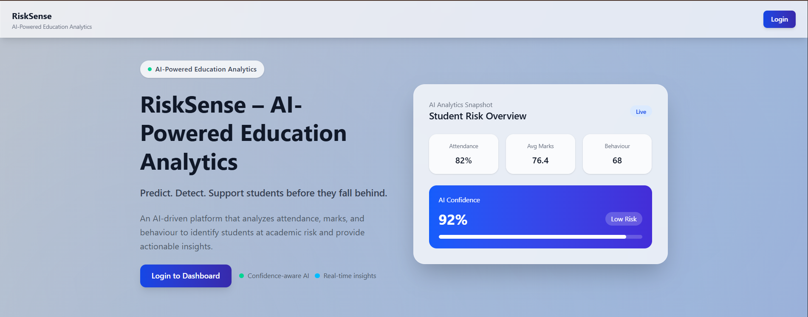

# 🎓 RiskSense – AI-Powered Education Analytics

<div align="center">

**AI-driven platform to identify and support at-risk students**

[](https://www.python.org/) [](https://fastapi.tiangolo.com/) [](https://reactjs.org/) [](https://www.mongodb.com/)

</div>

---

## 🌟 What is RiskSense?

RiskSense is an **AI-powered education analytics platform** that helps institutions identify struggling students early through predictive analysis. It analyzes attendance, academic marks, and behavior patterns to generate real-time risk predictions with confidence scores.

**Key Problem Solved:** Schools need a way to detect at-risk students *before* they fail, not after.

---

## 🚀 Key Features

| Feature | Description |
|---------|-------------|
| 🤖 **AI Risk Prediction** | ML model trained on 1,500 students predicts academic risk (0-100% confidence) |
| 📊 **Interactive Dashboard** | Real-time analytics with charts, badges, and student performance insights |
| 👨‍💼 **Admin Portal** | Secure JWT auth, student CRUD, manual entry, Excel upload |
| 🚨 **Smart Alerts** | Auto-generated alerts for high-risk students with severity levels |
| 🏷️ **Dynamic Badges** | Multi-badge system (Stable, Monitoring, Attendance Issue, Performance Drop, Behaviour Alert) |
| 📁 **Bulk Upload** | Excel file processing with duplicate detection and auto-refresh |

---

## 📸 Screenshots

### Home Page

*Landing page with AI logic explanation*

### Login Portal

*Admin authentication portal*

### Admin Dashboard

*Real-time student metrics and alerts*

### Analytics Portal

*Student detail view with confidence score and recommendations*

---

## 🧠 How the AI Works (The Smart Part)

### 📚 The 3 Features
The model learns from:
- **Attendance** → Class presence (%)
- **Marks** → Average subject score
- **Behaviour** → Classroom conduct (0-100)

### 🎯 What It Predicts
```
Input: [65% attendance, 72 marks, 45 behaviour]
    ↓
Model votes across 200 decision trees
    ↓
Output: "MEDIUM risk" with 72% confidence
```

### 🔑 Confidence ≠ Performance
**This is crucial:**
- **High confidence (80-100%)** = Clear pattern (student is clearly good OR clearly struggling)
- **Low confidence (40-60%)** = Mixed signals (borderline case, needs human review)

**Examples:**
- ✅ Star student: 92% attendance, 85 marks, 75 behaviour → LOW risk, 96% confidence
- ⚠️ Borderline: 69% attendance, 64 marks, 51 behaviour → MEDIUM risk, 58% confidence
- 🚨 Struggling: 50% attendance, 42 marks, 40 behaviour → HIGH risk, 100% confidence

**Medical analogy:** Just like a doctor can be 95% sure a patient is healthy OR 95% sure they're sick. Confidence shows clarity, not quality.

---

## 📂 Project Structure

```
Student/
│
├── backend/
│   ├── app/
│   │   ├── main.py                 # FastAPI application entry point
│   │   ├── config.py               # Configuration settings
│   │   ├── database.py             # MongoDB connection setup
│   │   ├── db.py                   # Database collections initialization
│   │   │
│   │   ├── routes/
│   │   │   ├── __init__.py
│   │   │   ├── admin_auth.py       # Admin login/authentication
│   │   │   ├── admin_student.py    # Student CRUD, Excel upload
│   │   │   ├── alerts.py           # Alerts management
│   │   │   ├── analytics.py        # Analytics endpoints
│   │   │   ├── notes.py            # Teacher notes
│   │   │   ├── prediction.py       # ML prediction endpoint
│   │   │   └── student.py          # Public student routes
│   │   │
│   │   ├── schemas/
│   │   │   ├── __init__.py
│   │   │   ├── student.py          # Student Pydantic models
│   │   │   ├── attendance.py       # Attendance schemas
│   │   │   ├── marks.py            # Marks schemas
│   │   │   ├── lms_activity.py     # LMS activity schemas
│   │   │   ├── prediction.py       # Prediction schemas
│   │   │   └── analytics.py        # Analytics schemas
│   │   │
│   │   ├── models/
│   │   │   ├── __init__.py
│   │   │   ├── student.py          # Student data models
│   │   │   ├── attendance.py       # Attendance models
│   │   │   ├── marks.py            # Marks models
│   │   │   └── lms_activity.py     # LMS activity models
│   │   │
│   │   ├── services/
│   │   │   ├── __init__.py
│   │   │   ├── alert_service.py    # Alert generation logic
│   │   │   ├── risk_service.py     # Risk calculation
│   │   │   ├── decline_service.py  # Performance decline detection
│   │   │   └── feature_engineering.py  # ML feature extraction
│   │   │
│   │   ├── ml/
│   │   │   ├── train_model.py      # ML model training script
│   │   │   ├── predictor.py        # Prediction functions
│   │   │   ├── generate_dataset.py # Dataset generation
│   │   │   │
│   │   │   ├── models/
│   │   │   │   ├── risk_model.pkl          # Trained Random Forest model
│   │   │   │   └── label_encoder.pkl       # Label encoder
│   │   │   │
│   │   │   └── data/
│   │   │       ├── risksense_1500_students_dataset.xlsx
│   │   │       └── sample_data.csv
│   │   │
│   │   ├── scripts/
│   │   │   └── generate_sample_data.py     # Sample data generator
│   │   │
│   │   └── utils/
│   │       ├── helpers.py          # Utility functions
│   │       └── logger.py           # Logging configuration
│   │
│   ├── requirements.txt            # Python dependencies
│   ├── README.md                   # Backend documentation
│   └── TEST_EXCEL_UPLOAD.md        # Excel upload guide
│
├── frontend/
│   ├── src/
│   │   ├── main.jsx                # React entry point
│   │   ├── App.jsx                 # Main app component
│   │   ├── index.css               # Global styles
│   │   │
│   │   ├── pages/
│   │   │   ├── Students.jsx        # Student list page (public)
│   │   │   ├── StudentDetail.jsx   # Student detail page
│   │   │   ├── Analytics.jsx       # Analytics dashboard
│   │   │   └── Alerts.jsx          # Alerts page
│   │   │
│   │   ├── admin/
│   │   │   ├── pages/
│   │   │   │   ├── AdminLogin.jsx  # Admin login page
│   │   │   │   ├── Dashboard.jsx   # Admin dashboard
│   │   │   │   ├── Students.jsx    # Admin student management
│   │   │   │   ├── ManualEntry.jsx # Manual student entry form
│   │   │   │   ├── ExcelUpload.jsx # Excel bulk upload
│   │   │   │   └── Alerts.jsx      # Admin alerts view
│   │   │   │
│   │   │   └── layout/
│   │   │       ├── AdminLayout.jsx # Admin layout wrapper
│   │   │       ├── Sidebar.jsx     # Admin sidebar
│   │   │       └── Topbar.jsx      # Admin topbar
│   │   │
│   │   ├── components/
│   │   │   ├── Navbar.jsx          # Main navbar
│   │   │   ├── Sidebar.jsx         # Public sidebar
│   │   │   ├── RiskBadge.jsx       # Risk badge component
│   │   │   ├── LineChartCard.jsx   # Chart component
│   │   │   ├── StudentCard.jsx     # Student card with badges
│   │   │   └── AdminProtectedRoute.jsx  # Route protection
│   │   │
│   │   ├── layouts/
│   │   │   ├── MainLayout.jsx      # Main layout
│   │   │   ├── DashboardLayout.jsx # Dashboard layout
│   │   │   └── PortalLayout.jsx    # Portal layout
│   │   │
│   │   └── api/
│   │       └── axios.js            # Axios configuration
│   │
│   ├── public/                     # Static assets
│   ├── package.json                # Node dependencies
│   ├── vite.config.js              # Vite configuration
│   ├── tailwind.config.js          # Tailwind configuration
│   ├── eslint.config.js            # ESLint configuration
│   └── README.md                   # Frontend documentation
│
├── screenshots/                    # UI screenshots
├── README.md                       # Main project documentation
└── .gitignore                      # Git ignore rules
```

---

---

## 🚀 Quick Setup

### Backend
```bash
cd backend
python -m venv venv
venv\Scripts\activate
pip install -r requirements.txt
python app/main.py
```

### Frontend
```bash
cd frontend
npm install
npm run dev
```

**Configure .env** in `backend/`:
```
MONGO_URL=mongodb://localhost:27017/risksense
JWT_SECRET=your-secret-key
```

**Access:**
- Admin: http://localhost:5173/admin/login (admin@gmail.com / admin123)
- API Docs: http://localhost:8000/docs

---

## 📡 API Endpoints

| Endpoint | Method | Purpose |
|----------|--------|---------|
| `/admin/login` | POST | Admin authentication |
| `/admin/all-students` | GET | List all students |
| `/admin/add-student` | POST | Add single student |
| `/admin/upload-excel` | POST | Bulk import students |
| `/admin/delete-student/{id}` | DELETE | Delete student |
| `/predict` | POST | Get risk prediction |
| `/alerts` | GET | Get all alerts |

**Add Student Payload:**
```json
{
  "name": "John Doe",
  "attendance": 85,
  "behaviour": 70,
  "subjects": [
    {"subject_name": "Math", "marks": 90},
    {"subject_name": "DBMS", "marks": 85}
  ]
}
```

---

## 💾 Database Schema

**students:** `{name, email, attendance, marks[], behaviour, avg_marks, predicted_label, confidence_score}`

**alerts:** `{student_id, message, alert_type, severity, is_read, created_at}`

**notes:** `{student_id, author, content, created_at}`

---

## 📖 Usage

**Admin:** Login → Add students (manual/Excel) → View analytics → Manage alerts

**Teachers:** View students → Click for details → Check risk score → Add notes

---

## 🤝 Contributing

Fork → Branch → Commit → Push → Pull Request

---

## 📄 License & Credits

**MIT License** | **Author:** Devang Singh

Built with ❤️ using FastAPI, React, scikit-learn, and MongoDB